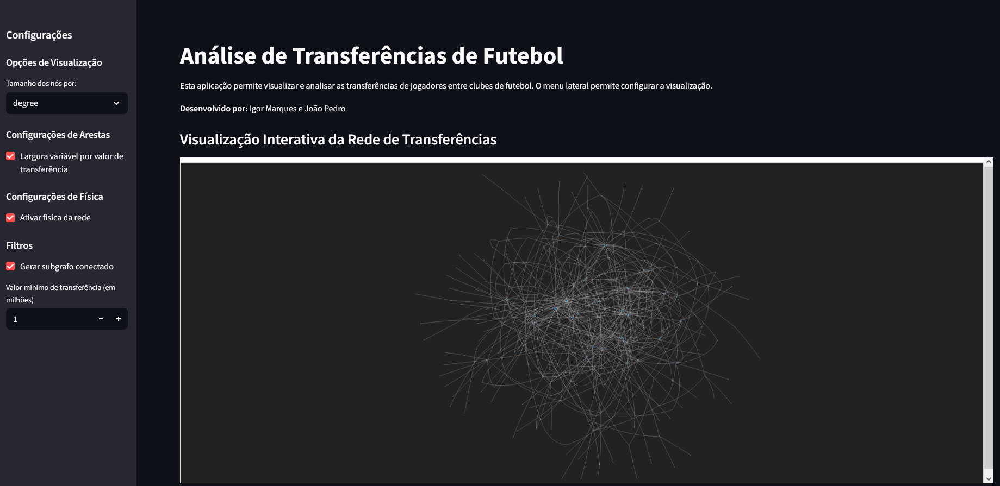

# Análise de Transferências de Futebol

Esta aplicação Streamlit permite visualizar e analisar as transferências de jogadores entre clubes de futebol como uma rede complexa. O projeto inclui visualizações interativas, métricas de rede e análises estatísticas das transferências.



## Funcionalidades

- Visualização interativa da rede de transferências usando Pyvis
- Configuração dinâmica do tamanho dos nós (por diferentes métricas de centralidade)
- Filtros por valor mínimo de transferência e componentes conectados
- Análise de métricas de rede (densidade, componentes conectados, assortatividade)
- Visualização da distribuição de grau
- Tabelas comparativas de centralidade para os clubes
- Matriz de adjacência dos principais clubes

## Como Usar

1. Clone o repositório:
   ```bash
   git clone https://github.com/igorzig13/analise-transferencias-futebol.git
   cd analise-transferencias-futebol
    ```
2. Crie um ambiente virtual e instale as dependências: 
    ```bash
    python -m venv venv
    source venv/bin/activate
    pip install -r requirements.txt
   ```
3. Substitua o arquivo transfers_final.csv na pasta do projeto (opcional).
4. Execute a aplicação:
    ```bash
   streamlit run script.py
   ```
5. Acesse no navegador: http://localhost:8501

## Estrutura do dataset

O projeto espera um arquivo CSV chamado transfers_final.csv com as seguintes colunas:

- team_name: Nome de um clube
- counter_team_name: Nome do clube parceiro na transferência
- dir: Direção da transferência ('in' ou 'left')
- transfer_fee_amnt: Valor da transferência em euros

## Autores
- Igor Marques
- João Pedro Fontes